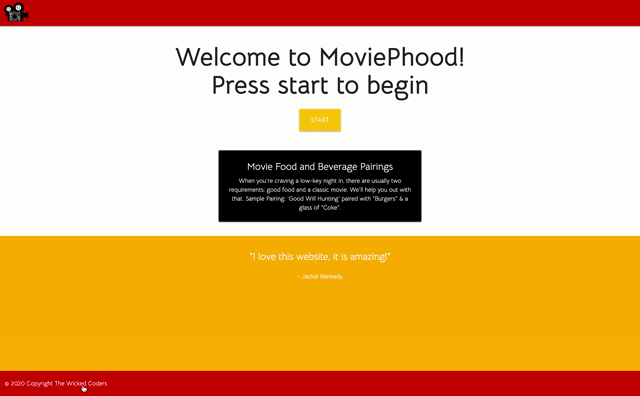

# Project 1 - Movie Phood

## Table of contents
* [General info](#general-info)
* [Technologies](#technologies)
* [How it Works](#how-it-works)
* [Authors](#authors)
* [Link to Page](#link-to-page)

## General info
An application to supply the user with a random selection of a movie, food item and beverage based on thier selections they enter.
    
## Technologies
This app runs in the browser and features a responsive layout using Materialize.css and is dynamically updated with jQuery/JavaScript. 

Other technology used: 

* [HMTL](https://developer.mozilla.org/en-US/docs/Web/HTML) - Gives application it's structure and DOM elements.
* [CSS](https://developer.mozilla.org/en-US/docs/Web/CSS) - Used to style the html elements/application.
* [Materialize.css](https://materializecss.com/) - Grid/Column system used to create page layout/structure.  Also used to create ansd style elements such as buttons, carousels, menus, and error messages.
* [JavaScript](https://developer.mozilla.org/en-US/docs/Web/JavaScript) - Used to dynamically display elements on html and get application to function/operate.
* [jQuery](https://jquery.com/) -  Used to simplify DOM traversal, event handling, and access to localstorge in written JavaScript.

* **APIs** -
[TheMealDB](https://www.themealdb.com/api.php)
[TheCocktailDB](https://www.thecocktaildb.com/api.php)
[TheMovieDB](https://www.themoviedb.org/)

## How it Works
On click of the amber “START” button on the home page, a user is shown three inputs and asked to enter three movies’ related to what they like or have recently viewed.  When the user clicks the “SUBMIT” button a random movie using theMovieDB’s recommendation API call is generated and the random recommended movie title, poster (image) pathway, release year, and plot are saved to an empty object and then sent to localstorage. 

A user is then displayed a select dropdown menu that is populated with theMealDB’s food categories and asked to select one of those food categories.  On click of another “SUBMIT” button a random meal based on the food category is generated using theMealDB’s filter API call.  The random meal’s title, image pathway, and URL to recipe is then saved to the same empty object and then sent to localstorage.

From there another select dropdown menu is shown to a user, and similar to the theMealDB’s food categories. The menu is populated with theCocktailDB’s drink categories, and a user is asked to select a drink category.   After selecting a drink category and clicking submit, the user is then generated a random drink based on the user’s selected drink category using theCocktailDB’s filter API call.  The generated drink’s title, image, and instructions are then saved to the empty object that contains the user’s movie and food information and then sent to localstorage.

Finally, the user is brought to the results page and using localstorage, the user’s movie, food, and drink information is retrieved and displayed dynamically to the page.  If the user is satisfied with their combination, they can select the “THUMBS-UP” button and a modal will appear thanking the user for using the application.  However, if a user is not satisfied with their combination, they can select the “THUMBS-DOWN” button and then be returned to the start of the application to try and find another combination. A user also has the option to view more snack ideas, by clicking the application’s logo that is below the “THUMBS-UP” and ”THUMBS-DOWN” buttons.  There, a new tab will open, and a user will be sent to an article that ranks movie snack ideas based on popularity.

## Authors

* **Gus Heptig** - *Contributor* - [gheptig](https://github.com/gheptig)
* **Megan Pardy-Gokcu** - *Contributor* - [megan-pg](https://github.com/megan-pg)
* **Diana Zsigray** - *Contributor* - [diana603](https://github.com/diana603)
* **Karla McLeod** - *Contributor* - [Kmcleod81](https://github.com/Kmcleod81)

## Link to Page

* https://gheptig.github.io/project-1/
